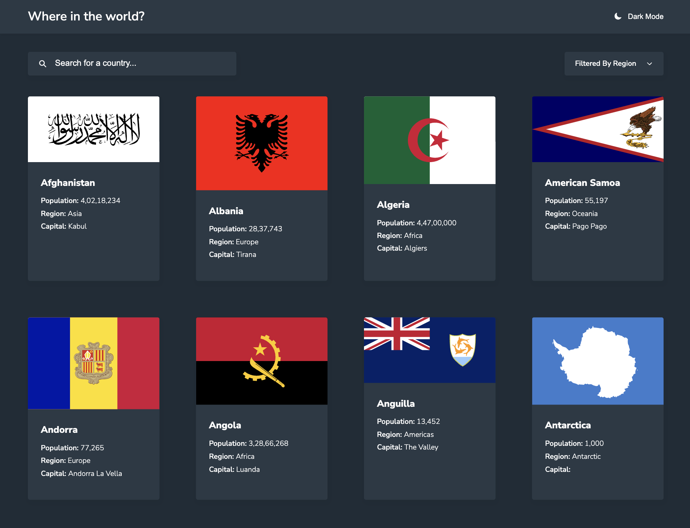
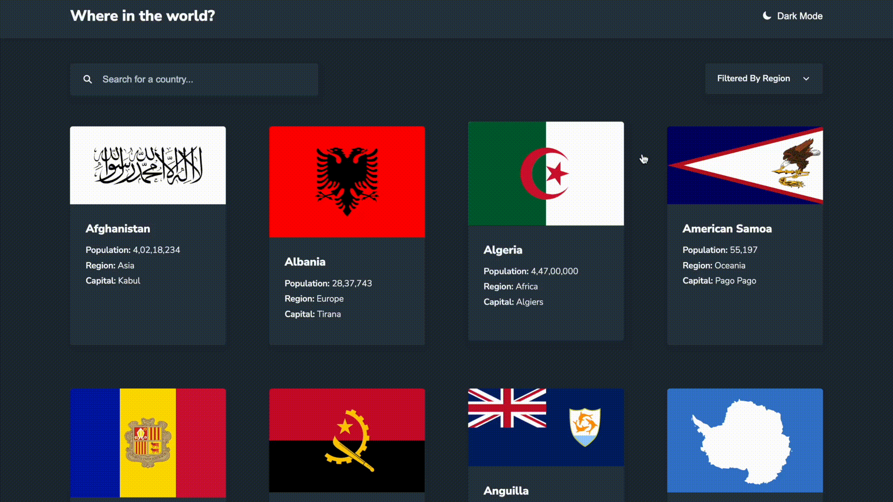

# Frontend Mentor - REST Countries API with color theme switcher solution

This is a solution to the [REST Countries API with color theme switcher challenge on Frontend Mentor](https://www.frontendmentor.io/challenges/rest-countries-api-with-color-theme-switcher-5cacc469fec04111f7b848ca). Frontend Mentor challenges help you improve your coding skills by building realistic projects.

## Table of contents

- [Overview](#overview)
  - [The challenge](#the-challenge)
  - [Screenshot](#screenshot)
  - [Links](#links)
- [My process](#my-process)
  - [Built with](#built-with)
  - [What I learned](#what-i-learned)
  - [Continued development](#continued-development)
  - [Useful resources](#useful-resources)
- [Author](#author)
- [Acknowledgments](#acknowledgments)

## Overview

### The challenge

Users should be able to:

- See all countries from the API on the homepage
- Search for a country using an `input` field
- Filter countries by region
- Click on a country to see more detailed information on a separate page
- Click through to the border countries on the detail page
- Toggle the color scheme between light and dark mode

### Screenshot




### Links

- Solution URL: [https://www.frontendmentor.io/solutions/responsive-spa-using-react-and-redux-toolkit-with-sass-grid-and-flexbox--0LLHhBFa-](https://www.frontendmentor.io/solutions/responsive-spa-using-react-and-redux-toolkit-with-sass-grid-and-flexbox--0LLHhBFa-)
- Live Site URL: [https://rest-countries-kv.netlify.app/](https://rest-countries-kv.netlify.app/)

## My process

### Built with

- Semantic HTML5 markup
- CSS custom properties
- Flexbox
- CSS Grid
- Desktop-first workflow
- [React](https://reactjs.org/) - JS library
- [Redux Toolkit](https://redux-toolkit.js.org/) - State Manager
- [React Router](https://reactrouter.com/) - For Routes
- [Axios](https://axios-http.com/) - For HTTP requests
- [Sass](https://sass-lang.com/) - CSS pre-processor

### What I learned

I've learned lot of things in this challenge:

- How to use Redux toolkit for state management

```js
// store/theme.js
import { createSlice } from '@reduxjs/toolkit';

const themeSlice = createSlice({
	name: 'theme',
	initialState: {
		isDark: window.matchMedia('(prefers-color-scheme: dark)').matches,
	},
	reducers: {
		toggle(state) {
			state.isDark = !state.isDark;
			document.querySelector('body').classList.toggle('dark-theme');
		},
	},
});

const { reducer: themeReducer, actions: themeActions } = themeSlice;
export { themeReducer as default, themeActions };
```

```js
// store/index.js
import { configureStore } from '@reduxjs/toolkit';
import themeReducer from './theme';

const store = configureStore({
	reducer: {
		theme: themeReducer,
		filterRegion: filterRegionReducer,
		countries: countriesReducer,
		search: searchReducer,
	},
});

export default store;
```

```js
// index.js
import { Provider } from 'react-redux';
import store from './store';

const root = ReactDOM.createRoot(document.getElementById('root'));
root.render(
	<Provider store={store}>
		<App />
	</Provider>
);
```

```js
// Uses | components/SearchBar
import { useDispatch, useSelector } from 'react-redux';
import { countriesActions } from '../../store/countries';
import { searchActions } from '../../store/search';

const SearchBar = () => {
	const isDark = useSelector(state => state.theme.isDark);
	const search = useSelector(state => state.search.value);
	const { searchCountry } = countriesActions;
	const { setSearch } = searchActions;
	const dispatch = useDispatch();

	const searchChangeHandler = e => {
		dispatch(setSearch(e.target.value));

		if (e.target.value.trim() === '') {
			return;
		}

		dispatch(searchCountry(e.target.value.trim()));
	};

	return (
		<Card className="search-bar">
			{isDark || <ion-icon name="search-sharp" />}
			{isDark && <ion-icon name="search-sharp" className="dark" />}
			<input
				className="search-bar__input"
				type="text"
				name="search"
				placeholder="Search for a country..."
				value={search}
				onChange={searchChangeHandler}
			/>
		</Card>
	);
};
```

- How to work with custom hooks

```js
// hooks/use-https
import axios from 'axios';
import { useCallback, useState } from 'react';

const useHttp = () => {
	const [isLoading, setIsLoading] = useState(false);
	const [error, setError] = useState(null);

	const sendRequest = useCallback(async (url, callback) => {
		setIsLoading(true);
		setError(null);

		try {
			const res = await axios.get(url);
			callback(res.data);
		} catch (err) {
			setError({ ...err, message: err.message || 'Something went wrong!' });
		}

		setIsLoading(false);
	}, []);

	return { isLoading, error, sendRequest };
};
```

- How to use react router

```js
const App = () => {
	return (
		<div className="App">
			<Header />
			<Routes>
				<Route path="/" element={<AllCountries />} />
				<Route path=":countryId" element={<Country />} />
				<Route path="*" element={<NotFound />} />
			</Routes>
			<Footer />
		</div>
	);
};
```

- How to use lazy loading

```js
import React, { Suspense } from 'react';

// Loaded only when these routes are visited
const NotFound = React.lazy(() => import('./pages/NotFound'));

const App = () => {
	return (
		<div className="App">
			<Header />
			<Suspense fallback={<Spinner />}>
				<Routes>
					<Route path="*" element={<NotFound />} />
				</Routes>
			</Suspense>
			<Footer />
		</div>
	);
};
```

- How to make dark themes in React with Sass

```scss
@mixin dark-theme {
	--color-bg: #202c37;
	--color-primary: #2b3945;
	--color-grey: #cbd5e1;
	--color-text: #ffffff;
}

@mixin light-theme {
	--color-bg: #fafafa;
	--color-primary: #ffffff;
	--color-grey: #64748b;
	--color-text: #111517;
}

:root {
	// Theme
	@include light-theme;
}

@media (prefers-color-scheme: dark) {
	:root {
		@include dark-theme;
	}

	.dark-theme {
		@include light-theme;
	}
}
```

### Continued development

Technologies I'd be learning soon:

- NextJs
- Typescript
- Testing (JS)
- Blockchain Development
- Flutter & Dart

### Useful resources

- [MDN Docs](https://developer.mozilla.org/en-US/) - This is an amazing reference which helped me finally understand detailed concepts like data- attr, aria attr, input range etc.
- [W3Schools](https://www.w3schools.com/) - This is an amazing website for learning, I've learned about semantic tags from here only and learned many important HTML elements. I'd recommend it to anyone still learning this concept.
- [React Router Docs](https://reactrouter.com/docs/en/v6) - Best reference to get start with React Router

## Author

- Github - [@vatsalsinghkv](https://github.com/vatsalsinghkv)
- Twitter - [@vatsalsinghkv](https://www.twitter.com/vatsalsinghkv)
- Instagram - [@vatsal.sing.hkv](https://www.instagram.com/vatsal.singh.kv)
- Facebook - [@vatsalsinghkv](https://www.facebook.com/vatsal.singh.kv)
- Frontend Mentor - [@vatsalsinghkv](https://www.frontendmentor.io/profile/vatsalsinghkv)

## Acknowledgments

- [Illustrations by Storyset](https://storyset.com/)
- [Earth Globe Icon (logo)](https://www.flaticon.com/free-icons/earth-globe)
- [How to throw error with status code in JS](https://stackoverflow.com/a/69166148)
